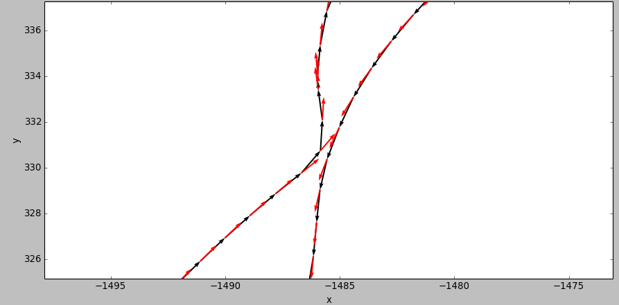

# GPS heading

## Overview

This component takes in GPS readings, gyroscope and rover motion commands and outputs a fused (via a complementary filter) heading value between two GPS readings and the gyroscope. Other orientation angles are canceled (pitch, roll).

It is useful to get a rough estimate of the heading in absence of absolute sensors. The component publishes GPS data as often as the GPS input, but the heading orientation (yaw) will only be updated every `dist_min` meters.

A python script under `/test` has been made to test the output of this component. Use `gps_replay.rb` to get the `gps_heading` data log file, then `pocolog` to delog the generated data and finally export the data and process it to fit for the python script.

**Authors: [Karl Kangur](mailto:karl.kangur@gmail.com "Contact the author"), [Jan Filip](mailto:jan.filip2@gmail.com "Contact the author")  
Contact: [Martin Azkarate](mailto:Martin.Azkarate@esa.int "Contact the maintainer")  
Affiliation: Automation and Robotics Laboratories, ESTEC, ESA**

## Installation

### Dependencies

This package does not have any dependencies.

### Building

In order to install, clone the latest version from this repository into your workspace under `control/orogen/gps_heading`, add the following line to `autoproj/manifest` under `layout:`

    - control/orogen/gps_heading

Execute the following to build the package:

    $ autoproj build

## Basic Usage

### gps_heading

#### Inputs

* **`gps_pose_samples`** (/base/samples/RigidBodyState)

GPS readings.

* **`imu_pose_samples`** (/base/samples/RigidBodyState)

Uncompensated input pose of the IMU.

* **`motion_command`** (/base/MotionCommand2D)

Rover motion control commands.

#### Outputs

* **`pose_samples_out`** (/base/samples/RigidBodyState)

GPS positions with filtered orientation.

* **`heading_drift`** (/double)

Estimated drift of the heading.

#### Parameters

* **`alpha`** (/double)

Complementary filter weight.

* **`dist_min`** (/double)

Minimum distance to travel between yaw updates (in meters).

* **`calibration_dist_min`** (/double)

Minimum distance to travel for the first heading estimation (calibration), should be higher than `dist_min`.

